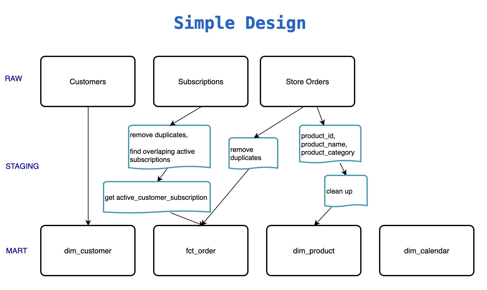

# Analytics Engineer Technical Case

I had a lot of fun taking part in this case. Following are the deliverables (a very basic dbt project) and my assumptions.

## Deliverables

1) The SQL code to get the KPIs from your new star schema models
  
    * [dbt models](./tibberdbt/models)
    * [dbt analysis](./tibberdbt/models)
  
- Visually or verbally present how the new tables fit together 
  
    * Star Model Diagram 
   
   

***

### Assumptions

- I assumed that it is valid for one customer to have more than one active subscription that overlaps in a given period. 

- Since `store-orders` do not have a `subscription_id`, we can track if an order was created by a customer who had any active subscription at that time.

- `dim_product` needs clean-up! It is far from how product master data would look like. Domain knowledge is very important for this task.
    
    * `product_id` would be replaced by a unique_business_key 
    * `product_name` has the potential to be split into two subcategories
    * There are extra spaces, a mix of languages, misspelling in many products. For example, these might be the same product: 
  
  | product_id | product_name                  | product_category        |
  |------------|-------------------------------|-------------------------|
  | 107354     | Zaptec Chill – Kabelhållare  | Accessories - EV charging |
  | 560867     | Zaptec Chill – Kabelholder   | Accessories - EV charging |
  | 82879      | Zaptec Chill – Kabelhalterung| Accessories - EV charging |

- `store-orders` (raw table) had duplicates that I assumed to be invalid.
  
- `subscriptions` (raw table) had duplicates when I transformed the dates to a date-only format. I assumed them to be invalid.

